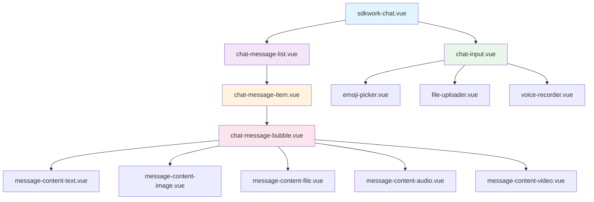
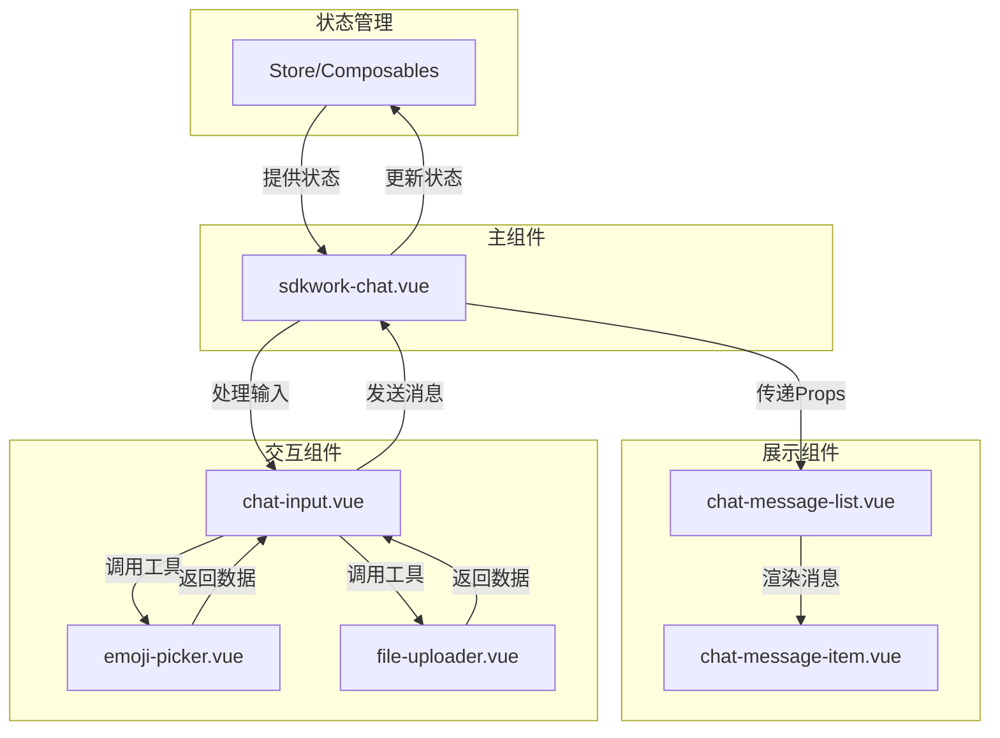

# SDKWork Chat 组件架构

## 🏗️ 组件层次结构



## 🔄 数据流架构



## 📊 组件职责矩阵

| 组件名称 | 职责描述 | 依赖关系 | 状态管理 |
|---------|---------|---------|---------|
| **sdkwork-chat.vue** | 聊天容器组件，协调所有子组件 | 无 | 管理聊天会话状态 |
| **chat-message-list.vue** | 消息列表容器，处理滚动和分页 | sdkwork-chat | 管理消息列表状态 |
| **chat-message-item.vue** | 单条消息展示组件 | chat-message-list | 管理消息项状态 |
| **chat-message-bubble.vue** | 消息气泡容器 | chat-message-item | 管理气泡样式状态 |
| **message-content-*.vue** | 消息内容展示组件 | chat-message-bubble | 无状态组件 |
| **chat-input.vue** | 消息输入组件 | sdkwork-chat | 管理输入状态 |
| **emoji-picker.vue** | 表情选择组件 | chat-input | 管理表情面板状态 |
| **file-uploader.vue** | 文件上传组件 | chat-input | 管理上传状态 |

## 🔧 接口设计规范

### 1. Props 接口设计

```typescript
// 主组件 Props
interface ChatProps {
  currentUser: User
  messages: Message[]
  config?: ChatConfig
  loading?: boolean
}

// 消息列表 Props
interface MessageListProps {
  messages: Message[]
  currentUserId: string
  hasMore?: boolean
  loading?: boolean
}

// 消息项 Props
interface MessageItemProps {
  message: Message
  currentUserId: string
  showTimestamp?: boolean
}
```

### 2. Emits 事件设计

```typescript
// 主组件 Emits
interface ChatEmits {
  (e: 'send-message', content: string): void
  (e: 'revoke-message', messageId: string): void
  (e: 'load-more'): void
}

// 消息项 Emits
interface MessageItemEmits {
  (e: 'click', message: Message): void
  (e: 'retry', messageId: string): void
  (e: 'revoke', messageId: string): void
}
```

## 🎨 样式架构

### 1. CSS 类名规范

```scss
// BEM 命名规范
.sdkwork-chat {
  &__container {
    // 容器样式
  }
  
  &__message-list {
    // 消息列表样式
    
    &--loading {
      // 加载状态修饰符
    }
  }
  
  &__message-item {
    // 消息项样式
    
    &--own {
      // 自己消息修饰符
    }
    
    &__bubble {
      // 气泡样式
      
      &__content {
        // 内容样式
      }
    }
  }
}
```

### 2. 主题变量系统

```scss
// 主题变量
:root {
  --chat-primary-color: #007aff;
  --chat-bg-color: #ffffff;
  --chat-border-color: #e5e5e5;
  --chat-text-color: #333333;
  
  // 消息气泡颜色
  --bubble-bg-own: #007aff;
  --bubble-bg-other: #f5f5f5;
  --bubble-text-own: #ffffff;
  --bubble-text-other: #333333;
}
```

## 🚀 性能优化策略

### 1. 虚拟滚动实现

```typescript
// 虚拟滚动计算
const virtualScroll = computed(() => {
  const startIndex = Math.floor(scrollTop.value / itemHeight)
  const endIndex = Math.min(startIndex + visibleCount, messages.value.length)
  
  return {
    startIndex,
    endIndex,
    visibleMessages: messages.value.slice(startIndex, endIndex),
    paddingTop: startIndex * itemHeight,
    paddingBottom: (messages.value.length - endIndex) * itemHeight
  }
})
```

### 2. 懒加载策略

```typescript
// 图片懒加载
const lazyLoadImage = (img: HTMLImageElement, src: string) => {
  const observer = new IntersectionObserver((entries) => {
    entries.forEach(entry => {
      if (entry.isIntersecting) {
        img.src = src
        observer.unobserve(img)
      }
    })
  })
  observer.observe(img)
}
```

### 3. 消息缓存机制

```typescript
// 消息缓存管理
const messageCache = new Map<string, Message>()

const getMessage = (id: string): Message | undefined => {
  if (messageCache.has(id)) {
    return messageCache.get(id)
  }
  
  const message = fetchMessage(id)
  messageCache.set(id, message)
  return message
}
```

## 📱 响应式设计

### 1. 断点设计

```scss
// 响应式断点
$breakpoint-mobile: 768px;
$breakpoint-tablet: 1024px;
$breakpoint-desktop: 1200px;

.chat-container {
  width: 100%;
  
  @media (min-width: $breakpoint-tablet) {
    width: 800px;
  }
  
  @media (min-width: $breakpoint-desktop) {
    width: 1000px;
  }
}
```

### 2. 移动端优化

```typescript
// 移动端手势支持
const handleSwipe = (direction: 'left' | 'right') => {
  if (direction === 'left') {
    // 显示消息操作菜单
  } else if (direction === 'right') {
    // 返回聊天列表
  }
}
```

## 🔒 安全考虑

### 1. XSS 防护

```typescript
// 消息内容安全处理
const sanitizeMessage = (content: string): string => {
  return content
    .replace(/</g, '<')
    .replace(/>/g, '>')
    .replace(/"/g, '"')
    .replace(/'/g, '&#x27;')
    .replace(/\//g, '&#x2F;')
}
```

### 2. 文件上传安全

```typescript
// 文件类型验证
const validateFileType = (file: File, allowedTypes: string[]): boolean => {
  const fileType = file.type.toLowerCase()
  return allowedTypes.some(type => {
    if (type.endsWith('/*')) {
      const baseType = type.split('/')[0]
      return fileType.startsWith(baseType)
    }
    return fileType === type
  })
}
```

---

*架构文档版本: v1.0.0*
*最后更新: 2025-09-29*